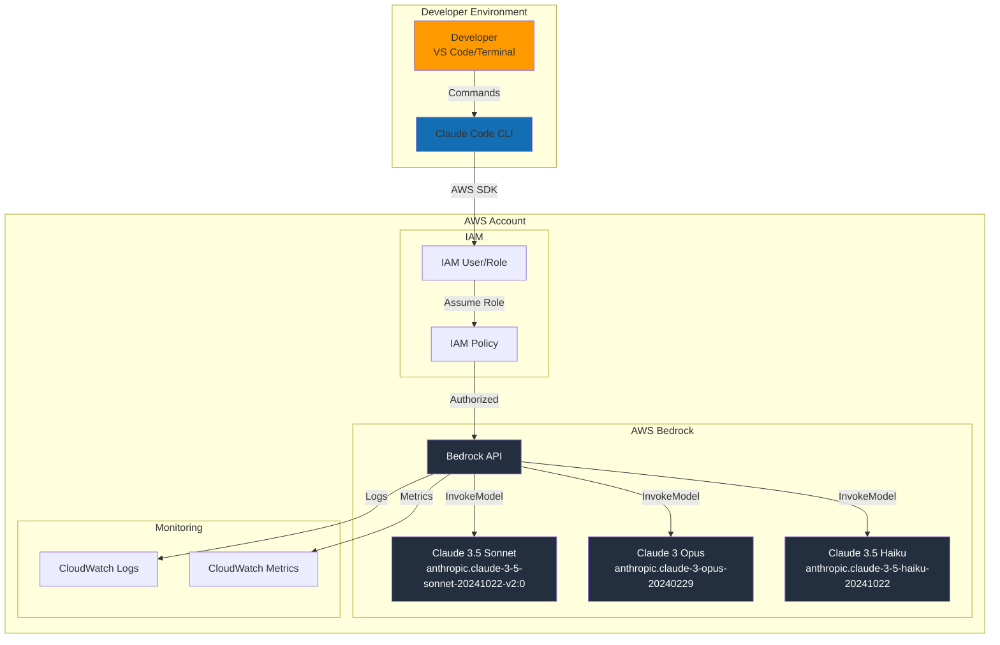
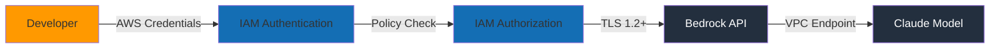

# AWS Bedrock Architecture for Claude Code

This diagram shows how Claude Code integrates with AWS Bedrock for AI-powered development.

## Architecture Diagram

## Component Description

### Developer Environment
- **Developer**: Uses IDE or terminal to interact with Claude Code
- **Claude Code CLI**: Communicates with AWS Bedrock via SDK

### AWS Account
- **IAM User/Role**: Provides authentication credentials
- **IAM Policy**: Grants permissions for Bedrock model invocation
- **Bedrock API**: Manages model requests and responses
- **Claude Models**: Foundation models for different use cases:
  - **Sonnet**: Balanced performance/cost (primary)
  - **Opus**: Maximum capability (complex tasks)
  - **Haiku**: Fastest/cheapest (simple tasks)

### Monitoring
- **CloudWatch Logs**: Request/response logging for audit
- **CloudWatch Metrics**: Usage tracking for cost optimization

## Request Flow

1. Developer issues command to Claude Code
2. Claude Code authenticates with IAM credentials
3. IAM policy authorizes Bedrock access
4. Bedrock routes to appropriate Claude model
5. Model processes request and returns response
6. Response logged to CloudWatch
7. Claude Code displays result to developer

## Security Layers

## Cost Optimization Points

1. **Model Selection**: Choose appropriate model for task complexity
2. **Token Management**: Minimize unnecessary context in prompts
3. **Caching**: Implement caching for repeated queries
4. **Batch Processing**: Group similar tasks when possible
5. **Monitoring**: Set CloudWatch alarms for cost thresholds

## Deployment Regions

Primary regions with Claude model availability:
- **us-west-2** (Oregon) - Primary
- **us-east-1** (N. Virginia)
- **eu-west-1** (Ireland)
- **ap-southeast-1** (Singapore)

## Usage in Workshop

This diagram is referenced in:
- **Exercise 004**: Understanding the AWS Bedrock integration
- **Blog Post 1**: Getting Started with Claude Code on AWS Bedrock
- **Blog Post 3**: CI/CD with Claude Code and AWS Bedrock

Students can use this to understand:
- How their commands reach Claude models
- Security boundaries and authentication flow
- Where to implement monitoring and cost controls
