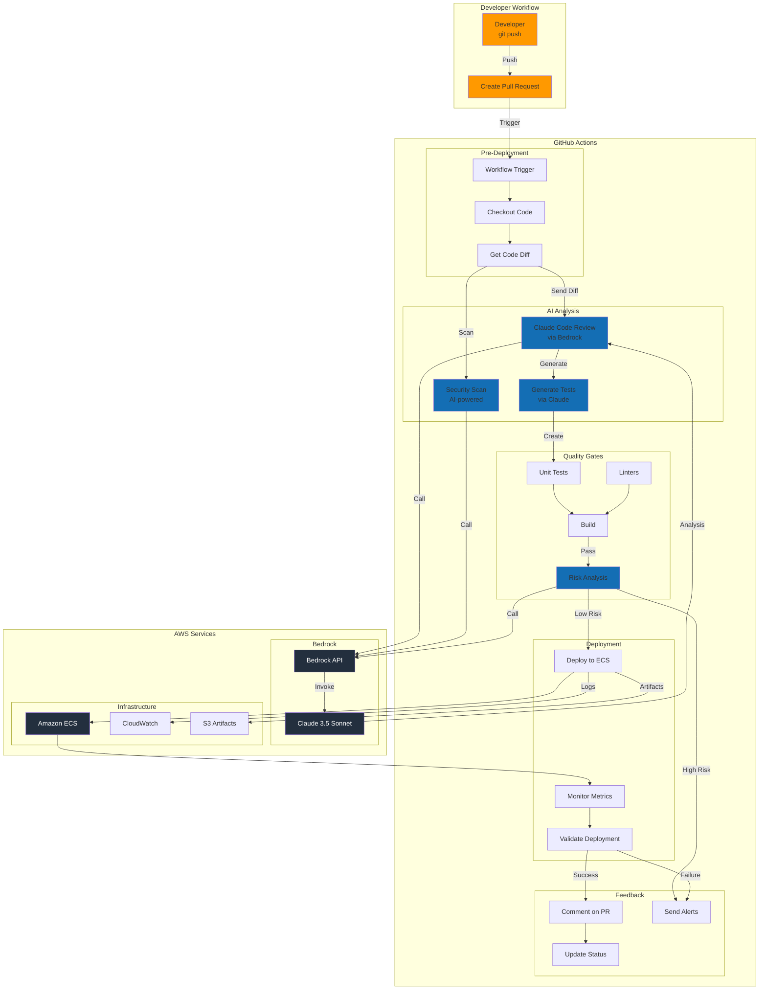
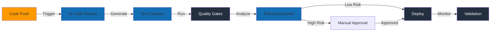
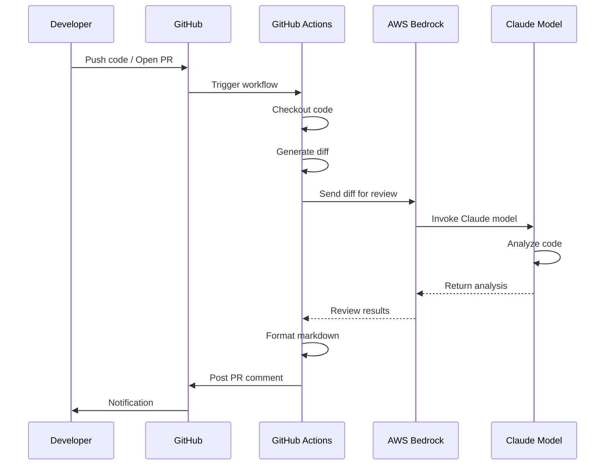
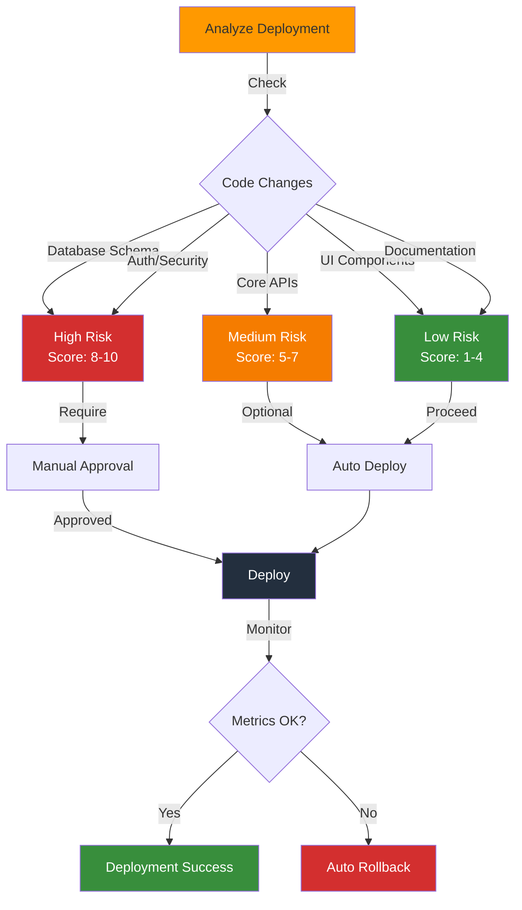
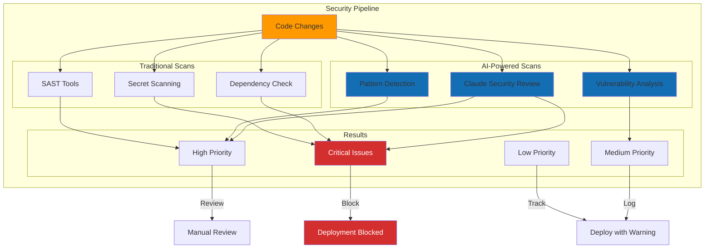
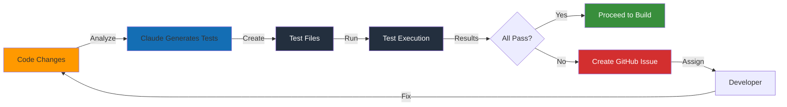
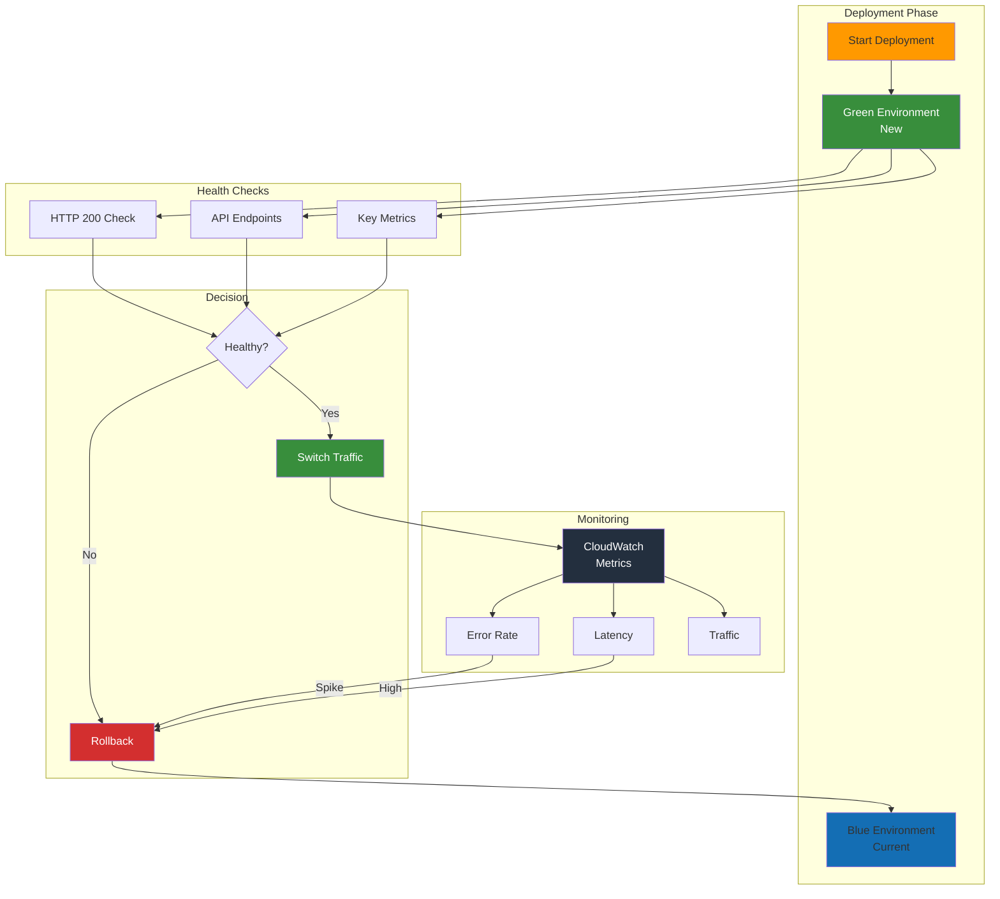

# CI/CD Pipeline with Claude Code and AWS Bedrock

This diagram shows the complete CI/CD workflow integrating Claude Code for automated code reviews, testing, and deployment.

## Full CI/CD Pipeline

## GitHub Actions Workflow Stages

## AI Code Review Flow

## Risk Analysis Decision Tree

## Security Scanning Integration

## Automated Testing Flow

## Deployment Monitoring

## Cost Optimization Strategy

```mermaid
graph TB
    OPT[Cost Optimization]

    subgraph "Caching"
        CACHE1[Cache Review Results]
        CACHE2[Reuse Test Generations]
        CACHE3[Store Analysis]
    end

    subgraph "Smart Triggers"
        TRIG1[Skip on Docs-Only]
        TRIG2[Partial on UI-Only]
        TRIG3[Full on Core Changes]
    end

    subgraph "Model Selection"
        MOD1[Haiku for Simple Tasks]
        MOD2[Sonnet for Reviews]
        MOD3[Opus for Complex Only]
    end

    subgraph "Batch Processing"
        BATCH1[Group Similar Files]
        BATCH2[Parallel Reviews]
        BATCH3[Rate Limiting]
    end

    OPT --> CACHE1
    OPT --> CACHE2
    OPT --> CACHE3
    OPT --> TRIG1
    OPT --> TRIG2
    OPT --> TRIG3
    OPT --> MOD1
    OPT --> MOD2
    OPT --> MOD3
    OPT --> BATCH1
    OPT --> BATCH2
    OPT --> BATCH3

    style OPT fill:#FF9900
    style CACHE1 fill:#146EB4
    style CACHE2 fill:#146EB4
    style CACHE3 fill:#146EB4
    style TRIG3 fill:#232F3E,color:#fff
    style MOD2 fill:#232F3E,color:#fff
```

## Usage in Workshop

This diagram is referenced in:
- **Blog Post 3**: CI/CD with Claude Code and AWS Bedrock
- **Exercise 009**: Understanding GitHub integration

Students can use this to:
- Understand complete CI/CD pipeline with AI integration
- Identify decision points and automation opportunities
- Plan security scanning integration
- Design deployment strategies with risk assessment
- Implement cost-effective AI workflows

## Key Metrics to Track

1. **Code Quality**:
   - Bugs caught by AI vs human review
   - Time to review (AI vs manual)
   - False positive rate

2. **Deployment**:
   - Deployment frequency
   - Lead time for changes
   - Mean time to recovery (MTTR)
   - Change failure rate

3. **Cost**:
   - Bedrock API calls per deployment
   - Token usage trends
   - Cost per review/test generation

4. **Security**:
   - Vulnerabilities detected
   - Mean time to remediate
   - Security scan coverage
