# Claude Code Hooks Pipeline

This diagram illustrates the hook system in Claude Code, showing pre-tool and post-tool execution flows.

## Complete Hook Lifecycle

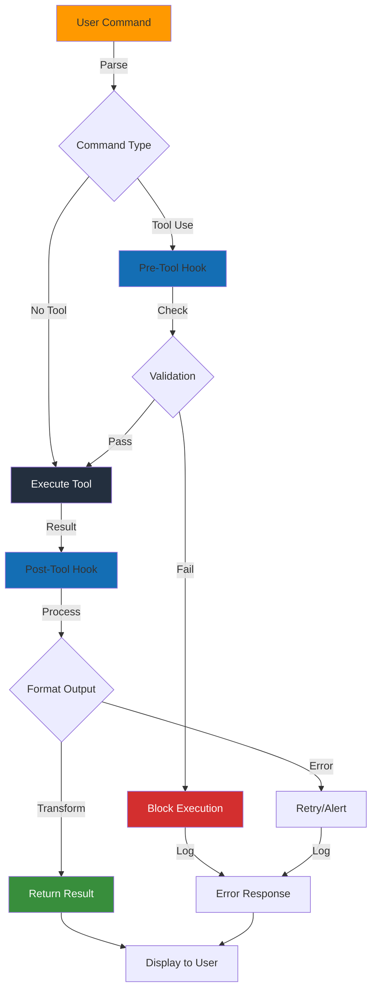

## Pre-Tool Hook Flow

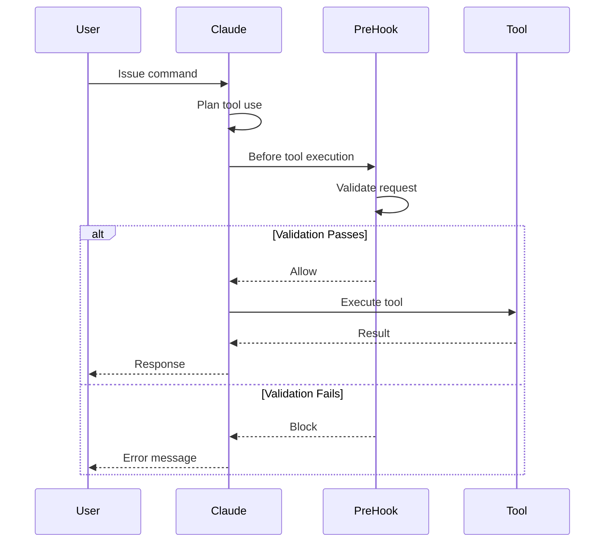

## Post-Tool Hook Flow

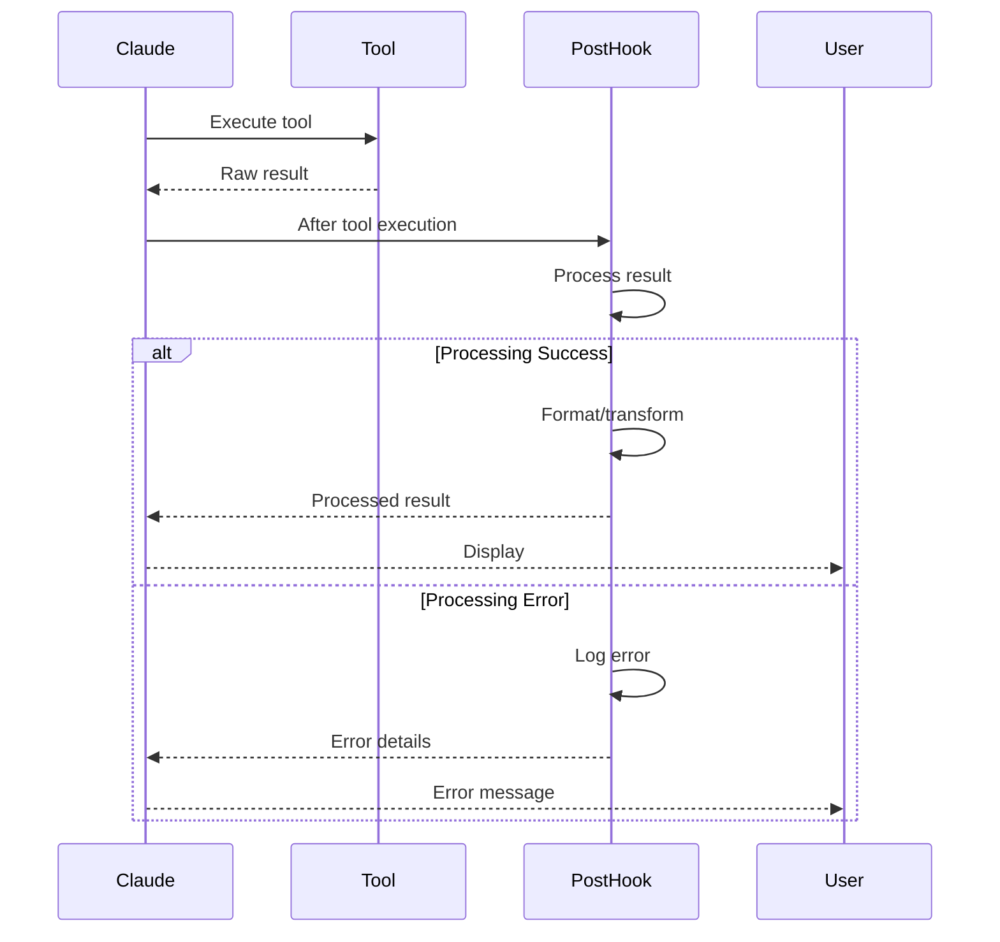

## Hook Types and Use Cases

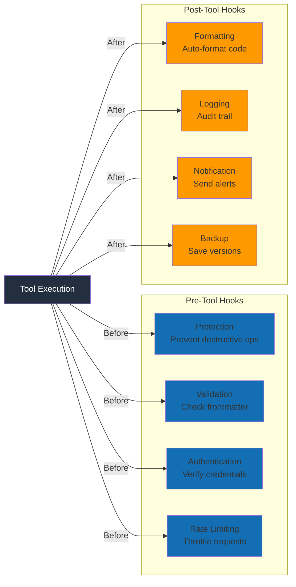

## Protection Hook Example

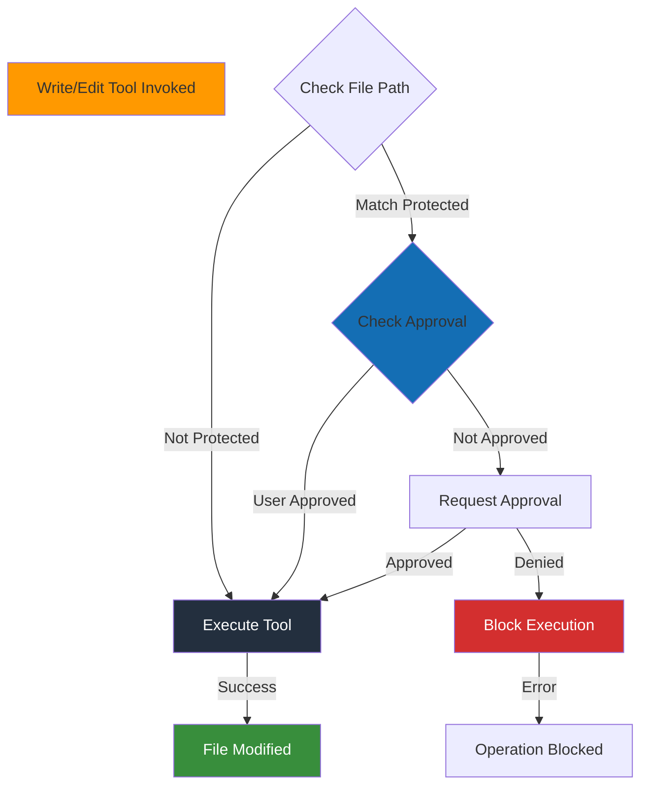

### Protection Hook Logic

```javascript
// Pseudo-code for protection hook
function preToolHook(tool, args) {
  const protectedPaths = [
    'package.json',
    'tsconfig.json',
    '.env'
  ];

  if (tool === 'Write' || tool === 'Edit') {
    const filePath = args.file_path;

    if (protectedPaths.some(p => filePath.includes(p))) {
      // Request user approval
      return {
        action: 'request_approval',
        message: `Modifying protected file: ${filePath}`
      };
    }
  }

  return { action: 'allow' };
}
```

## Formatting Hook Example

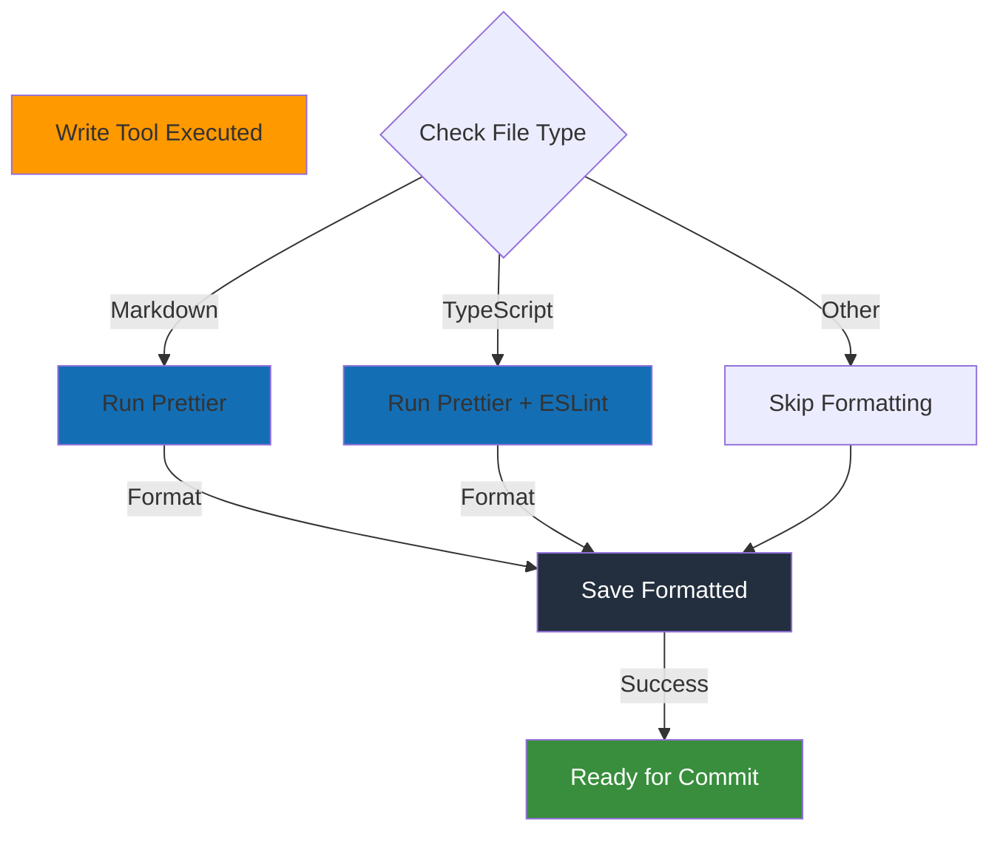

### Formatting Hook Logic

```javascript
// Pseudo-code for formatting hook
async function postToolHook(tool, args, result) {
  if (tool === 'Write' || tool === 'Edit') {
    const filePath = args.file_path;

    if (filePath.endsWith('.md')) {
      // Run Prettier on markdown
      await exec(`prettier --write "${filePath}"`);
    } else if (filePath.endsWith('.ts') || filePath.endsWith('.tsx')) {
      // Run Prettier + ESLint
      await exec(`prettier --write "${filePath}"`);
      await exec(`eslint --fix "${filePath}"`);
    }
  }

  return result;
}
```

## Validation Hook Example (Frontmatter)

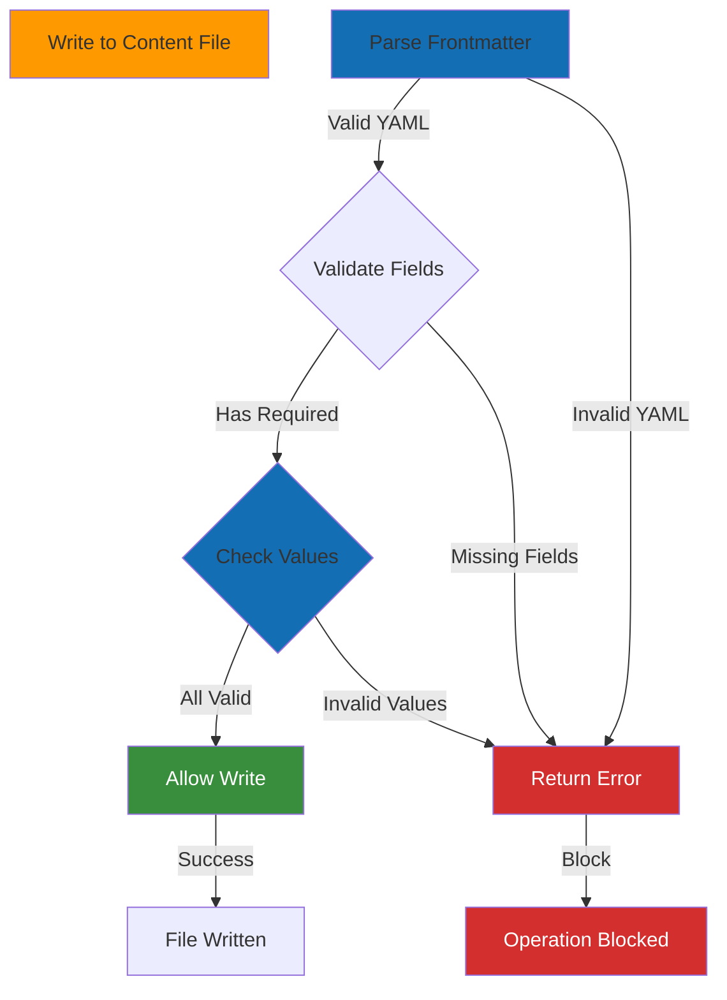

### Validation Hook Logic

```javascript
// Pseudo-code for validation hook
function preToolHook(tool, args) {
  if (tool === 'Write' && args.file_path.includes('/content/posts/')) {
    const content = args.content;
    const frontmatter = extractFrontmatter(content);

    // Required fields
    const required = ['title', 'date', 'author', 'category'];
    const missing = required.filter(f => !frontmatter[f]);

    if (missing.length > 0) {
      return {
        action: 'block',
        message: `Missing required fields: ${missing.join(', ')}`
      };
    }

    // Validate date format
    if (!isValidDate(frontmatter.date)) {
      return {
        action: 'block',
        message: 'Invalid date format. Use YYYY-MM-DD'
      };
    }

    // Validate category
    const validCategories = ['Tutorial', 'Guide', 'Reference'];
    if (!validCategories.includes(frontmatter.category)) {
      return {
        action: 'block',
        message: `Invalid category. Must be: ${validCategories.join(', ')}`
      };
    }
  }

  return { action: 'allow' };
}
```

## Hook Composition

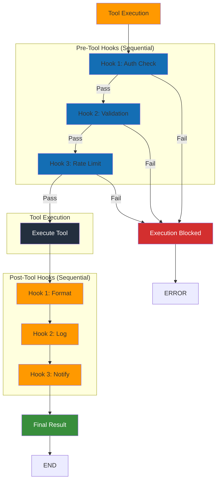

## Hook Configuration

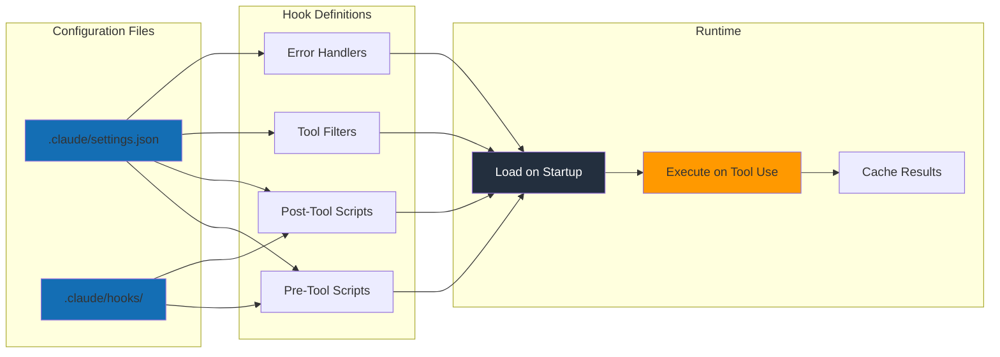

## Error Handling in Hooks

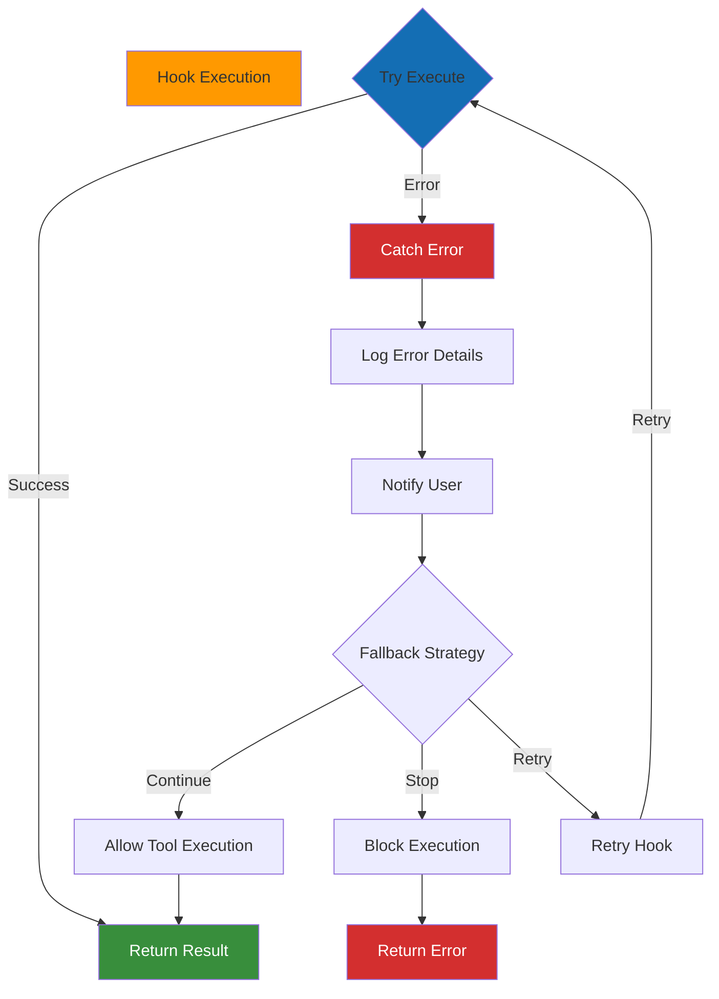

## Performance Optimization

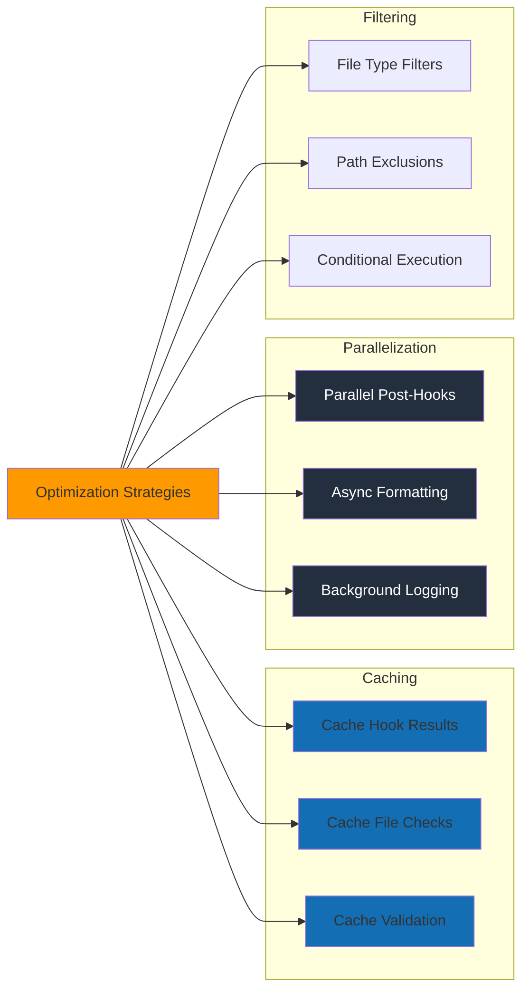

## Usage in Workshop

This diagram is referenced in:
- **Exercise 010**: Understanding hooks
- **Exercise 011**: Defining protection hooks
- **Exercise 012**: Implementing formatting hooks
- **Exercise 013**: Composing multiple hooks
- **Blog Post 4** (optional): Advanced hook patterns

Students can use this to:
- Understand pre-tool and post-tool execution flow
- Design validation and protection strategies
- Implement formatting automation
- Debug hook execution issues
- Optimize hook performance

## Key Concepts

1. **Pre-Tool Hooks**: Execute BEFORE tool runs, can block execution
2. **Post-Tool Hooks**: Execute AFTER tool runs, can transform output
3. **Hook Composition**: Multiple hooks run sequentially in order
4. **Error Handling**: Hooks must handle errors gracefully
5. **Performance**: Hooks should be fast to avoid slowing Claude Code
6. **Restart Required**: Hook changes require Claude Code restart
