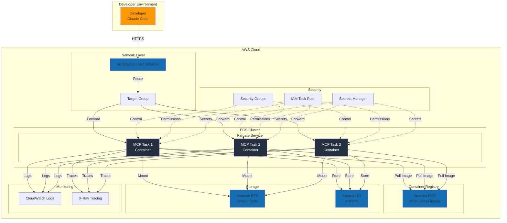
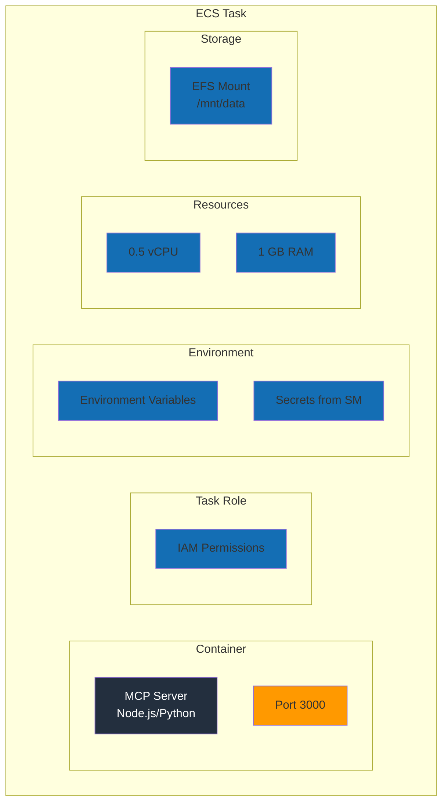
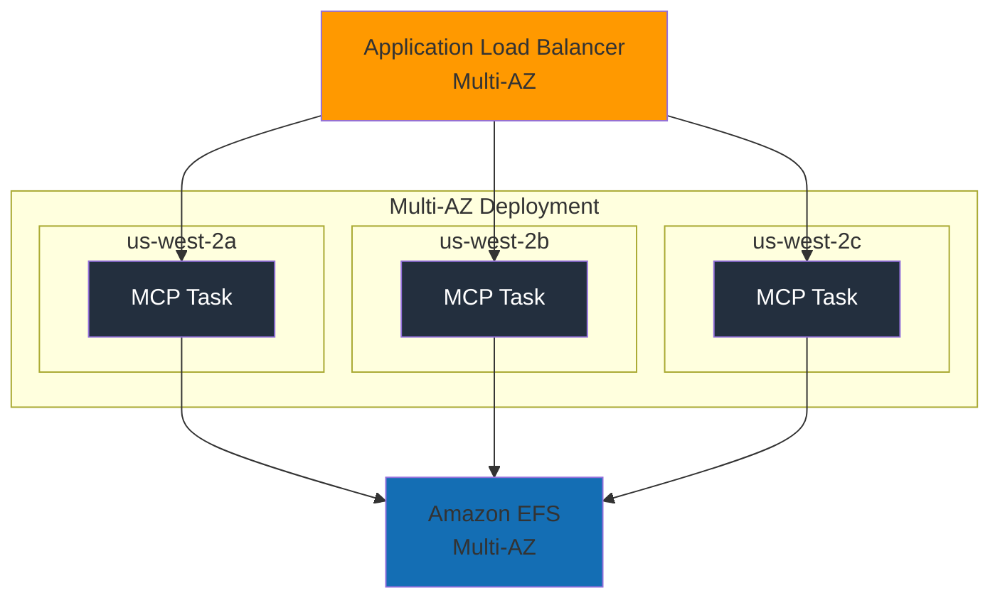
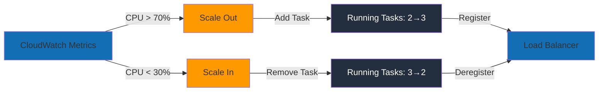

# MCP Server Deployment on AWS ECS

This diagram shows the complete architecture for deploying MCP servers on AWS using ECS Fargate.

## Full Architecture

## Deployment Pipeline

## Component Details

### Network Layer
- **Application Load Balancer**: TLS termination, health checks, routing
- **Target Group**: Manages ECS task registration and health

### ECS Cluster
- **Fargate Service**: Serverless container orchestration
- **MCP Tasks**: Individual container instances running MCP servers
- **Auto Scaling**: Scale based on CPU/memory or custom metrics

### Container Registry
- **Amazon ECR**: Private Docker registry for MCP server images
- **Image Scanning**: Automated vulnerability scanning
- **Lifecycle Policies**: Automatic cleanup of old images

### Storage
- **Amazon EFS**: Shared filesystem for stateful MCP servers
- **Amazon S3**: Artifact storage, backups, logs archival

### Security
- **Security Groups**: Network-level firewall rules
- **IAM Task Role**: Permissions for AWS service access
- **Secrets Manager**: Secure credential storage

### Monitoring
- **CloudWatch Logs**: Centralized logging
- **X-Ray**: Distributed tracing for performance analysis

## Task Configuration

## High Availability Setup

## Scaling Strategy

## Cost Optimization

1. **Right-size Tasks**: Start with 0.5 vCPU / 1 GB, adjust based on metrics
2. **Fargate Spot**: Use for non-critical workloads (70% cost savings)
3. **Auto Scaling**: Scale to zero during off-hours
4. **ECR Lifecycle**: Delete images older than 90 days
5. **EFS**: Use Infrequent Access storage class

## Security Best Practices

1. **Network Isolation**: Private subnets for tasks, public for ALB only
2. **Least Privilege**: IAM task role with minimum required permissions
3. **Secrets Management**: Never hardcode credentials, use Secrets Manager
4. **TLS Everywhere**: HTTPS on ALB, TLS between services
5. **Image Scanning**: Enable ECR scan-on-push
6. **CloudWatch Alarms**: Alert on security group changes

## Usage in Workshop

This diagram is referenced in:
- **Blog Post 2**: Deploying MCP Servers on AWS ECS
- **Exercise 008**: Understanding MCP server architecture

Students can use this to:
- Visualize complete MCP deployment architecture
- Understand AWS service interactions
- Plan their own MCP server deployments
- Identify security and scaling considerations
